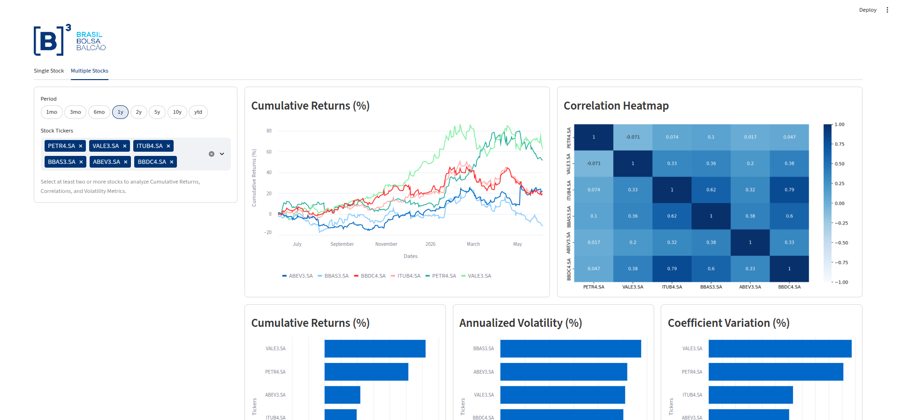

# B3 Stocks Dashboard


## Overview

Interactive Streamlit dashboard for Brazilian B3 stocks. It shows real-time quotes, historical trends, and multi-stock comparisons using Yahoo Finance data.

<p align="center">
  
</p>

<p align="center">
  
</p>

## Features

Single Stock tab:

- Live quote row with change percent and OHLC prices in BRL.
- Close price history chart for the selected period.
- Eight metric stats panel with volatility and returns.
- Company profile popover with sector and website.

Multiple Stocks tab:

- Cumulative returns chart for all selected tickers.
- Correlation heatmap of daily returns.
- Ranked bars for return, volatility, and variation.
- Guardrail warning when fewer than two tickers are picked.

Platform:

- Layered architecture with pure analytics and isolated UI.
- Frozen dataclass models for type safety.
- Friendly error UI with expandable details.
- Streamlit caching for fast reloads.

## Tech Stack

| Layer | Technology |
| ----- | ---------- |
| App | Streamlit 1.54 |
| Data | yfinance, pandas, numpy |
| Charts | Streamlit charts, matplotlib, seaborn |
| Language | Python 3.12+ |
| Quality | pytest, pytest-cov, ruff, mypy |

## Project Structure

```text
B3_Stocks_Dashboard/
├── app/
│   ├── main.py
│   ├── config.py
│   ├── constants.py
│   ├── models.py
│   ├── errors.py
│   ├── data/yfinance_client.py
│   ├── analytics/statistics.py
│   ├── analytics/comparison.py
│   ├── ui/formatters.py
│   ├── ui/components/
│   └── ui/views/
├── tests/
├── docs/screenshots/
├── .streamlit/config.toml
├── pyproject.toml
├── requirements.txt
├── requirements-dev.txt
├── LICENSE
└── README.md
```

## Installation

Prerequisites: Python 3.12+, pip.

```bash
python -m venv .venv
source .venv/bin/activate
pip install -r requirements.txt
streamlit run app/main.py
```

Open <http://localhost:8501> in your browser.

For development tools:

```bash
pip install -r requirements-dev.txt
```

## Usage

Single Stock:

1. Open Single Stock tab.
2. Pick a period and ticker.
3. Check About for company info.
4. Review quote row and stats panel.
5. Inspect price chart.

Multiple Stocks:

1. Open Multiple Stocks tab.
2. Pick a period and two or more tickers.
3. Review cumulative chart and heatmap.
4. Compare ranking bars.

## Configuration

Periods live in `app/config.py`:

```python
PERIODS = ['1mo', '3mo', '6mo', '1y', '2y', '5y', '10y', 'ytd']
```

Universe has 87 IBOVESPA tickers with `.SA` suffix. Defaults use six liquid names for quick analysis.

Theme lives in `.streamlit/config.toml`. Logo path is `docs/screenshots/B3_Logo.png` via `app/constants.py`.

## API Reference

Models:

- `TickerInfo`: quote plus profile fields.
- `StockStatistics`: eight period metrics.
- `ComparisonResult`: bundle of compare frames.

Data:

- `fetch_history(ticker, period)`: OHLC history with Date column.
- `fetch_close_prices(period, tickers)`: aligned close prices.
- `fetch_ticker_info(ticker)`: live quote and profile.

Analytics:

- `calculate_statistics(history)`: stats from OHLC frame.
- `calculate_returns(prices)`: daily returns, first row zero.
- `cumulative_returns_period(returns)`: cumulative percent series.
- `cumulative_returns_ranking(returns)`: sorted total returns.
- `annualized_volatility(returns)`: sorted yearly volatility.
- `coefficient_variation(prices)`: sorted variation values.

## Testing and Linting

```bash
python -m pytest -v
python -m pytest --cov=app
ruff check .
ruff format --check .
python -m mypy app/
```

Tests use real logic with mocked yfinance. Analytics and formatters have full unit coverage.

## Caching and Performance

`fetch_history` and `fetch_close_prices` use 1 hour cache (3600s, double-cache with Stooq fallback). `fetch_ticker_info` uses 30 minute TTL (1800s). Analytics avoids N+1 work with vectorized pandas. Charts use fixed heights from constants.

Clear cache with:

```bash
streamlit cache clear
```

## Troubleshooting

| Issue | Fix |
| ----- | --- |
| Select at least two stocks | Pick 2+ tickers in multiselect. |
| Could not load data banner | Check connection, open Error details (dev only). |
| Empty chart | Try another period or ticker. |
| Stale quote | Wait 30 minutes or clear cache. |
| Logo missing | Verify `docs/screenshots/B3_Logo.png` exists. |
| Slow first load | First fetch downloads history, later hits cache. |
| Ticker not found | Use `.SA` suffix, example `PETR4.SA`. |

## Roadmap

- Technical indicators like RSI and MACD.
- Price alerts and portfolio export.
- Saved user preferences.
- Risk dashboard and predictions.

## License

MIT License. See `LICENSE` for details.

## Author

Renato. See `[project.authors]` in `pyproject.toml`.

## Disclaimer

Educational tool only, not financial advice. Past performance does not predict future results. Consult a licensed professional before investing.
