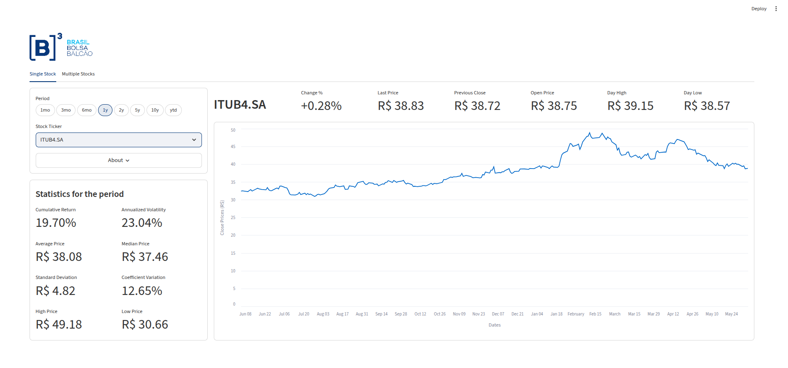

# B3 Stocks Dashboard

## Overview

The **B3 Stocks Dashboard** is an interactive web application for analyzing Brazilian stock market data from the **B3 (Brasil, Bolsa, Balcão)** exchange. Built with [Streamlit](https://streamlit.io), it provides real-time stock quotes, historical analysis, and comparative metrics for tracking investment performance and market trends.

The application enables investors and analysts to monitor individual stock performance, analyze historical statistics, and conduct portfolio comparisons with detailed visualizations — including price charts, correlation heatmaps, and volatility metrics — all sourced from [Yahoo Finance](https://finance.yahoo.com/) via the [`yfinance`](https://pypi.org/project/yfinance/) library.

<p align="center">
  
  
</p>

---

## Features

### Single Stock Analysis (`Single Stock` tab)
- **Real-time quote row**: ticker label, intraday change %, last price, previous close, open, day high, day low — all formatted in BRL.
- **Historical close-price chart**: interactive Streamlit line chart over the selected period.
- **Period statistics panel** (2×4 grid): cumulative return, average price, standard deviation, high price, annualized volatility, median price, coefficient of variation, low price.
- **About popover**: company long name, business summary, website, sector, and industry.
- **Period selector**: pill control with `1mo`, `3mo`, `6mo`, `1y`, `2y`, `5y`, `10y`, `ytd`.
- **Ticker selector**: full IBOVESPA universe (87+ tickers) from `app/config.py`.

### Multiple Stocks Comparison (`Multiple Stocks` tab)
- **Cumulative returns time-series chart** for all selected tickers.
- **Correlation heatmap** (seaborn) of pairwise daily-return correlations.
- **Three ranking horizontal bars**, all sorted descending:
  - Cumulative return (%)
  - Annualized volatility (%)
  - Coefficient of variation (%)
- **Period selector** and **multi-select ticker box** (defaults to a quick-analysis basket: `PETR4.SA`, `VALE3.SA`, `ITUB4.SA`, `BBAS3.SA`, `ABEV3.SA`, `BBDC4.SA`).
- **Guardrails**: friendly warning when fewer than 2 tickers are selected, and graceful error UI on data-fetch failures.

### Application-wide
- **Layered architecture**: data, analytics, and UI are isolated under `app/data/`, `app/analytics/`, and `app/ui/`.
- **Domain models** as frozen dataclasses (`TickerInfo`, `StockStatistics`, `ComparisonResult`).
- **Friendly error handling** via a `handle_data_errors` decorator that shows inline Streamlit errors with collapsible exception details.
- **Streamlit caching** to minimize calls to `yfinance`.

---

## Technical Stack

| Component | Technology |
|-----------|-----------|
| **Frontend / app framework** | Streamlit |
| **Data source** | yfinance (Yahoo Finance) |
| **Data processing** | Pandas, NumPy |
| **Visualization** | Matplotlib, Seaborn, Streamlit native charts |
| **Programming language** | Python 3.10+ |
| **Tooling** | ruff (lint + format), mypy (static type checking) |

Runtime dependencies and version ranges are declared in `pyproject.toml` and pinned in `requirements.txt`.

---

## Installation

### Prerequisites
- **Python 3.10 or higher** (matches `pyproject.toml` `requires-python`)
- `pip` (Python package manager)

### Setup Instructions

1. **Clone or download the project**
   ```bash
   cd B3_Stocks_Dashboard
   ```

2. **Create a virtual environment** (recommended)
   ```bash
   python -m venv .venv
   ```

3. **Activate the virtual environment**
   - On Windows:
     ```bash
     .venv\Scripts\activate
     ```
   - On macOS/Linux:
     ```bash
     source .venv/bin/activate
     ```

4. **Install runtime dependencies**
   ```bash
   pip install -r requirements.txt
   ```

5. **(Optional) Install development tools** — ruff + mypy:
   ```bash
   pip install -r requirements-dev.txt
   ```

6. **Run the application**
   ```bash
   streamlit run app/main.py
   ```

7. **Open the dashboard**
   Navigate to <http://localhost:8501> in your browser.

---

## Project Structure

The application code is organized as a Python package under `app/`, with a clear separation between data access, analytics, and presentation. UI elements are split into reusable **components** and composed **views**.

```
B3_Stocks_Dashboard/
├── app/
│   ├── __init__.py
│   ├── main.py                # Application entry point (run with `streamlit run app/main.py`)
│   ├── config.py              # PERIODS, STOCKS, STOCKS_DEFAULT (IBOVESPA universe)
│   ├── constants.py           # TRADING_DAYS_PER_YEAR, cache TTLs, defaults, chart heights, LOGO_PATH
│   ├── models.py              # Frozen dataclasses: TickerInfo, StockStatistics, ComparisonResult
│   ├── errors.py              # `show_data_error` / `handle_data_errors` decorator for the UI
│   ├── data/
│   │   └── yfinance_client.py # Single point of contact with yfinance
│   ├── analytics/
│   │   ├── statistics.py      # Pure single-stock statistics
│   │   └── comparison.py      # Pure multi-stock comparison analytics
│   └── ui/
│       ├── formatters.py      # BRL / percentage display helpers
│       ├── components/        # Reusable Streamlit widgets
│       │   ├── about_popover.py
│       │   ├── comparison_controls.py
│       │   ├── correlation_heatmap.py
│       │   ├── cumulative_returns_chart.py
│       │   ├── header.py
│       │   ├── horizontal_bar.py
│       │   ├── price_chart.py
│       │   ├── statistics_panel.py
│       │   └── ticker_metrics_row.py
│       └── views/             # Composed views (one per tab)
│           ├── single_stock_view.py
│           └── comparison_view.py
├── .streamlit/
│   └── config.toml            # Theme (light base, B3-inspired primary color)
├── images/                    # Assets (B3 logo, dashboard screenshots)
├── pyproject.toml             # Project metadata + tooling config (ruff, mypy)
├── requirements.txt           # Pinned runtime dependencies
├── requirements-dev.txt       # Development dependencies (ruff, mypy)
├── .gitignore
└── README.md
```

---

## Configuration

### Stocks and Periods

All static configuration lives in `app/config.py`. Edit it to customize the selectable universe and the default period.

#### Available Periods
```python
PERIODS: list[str] = ["1mo", "3mo", "6mo", "1y", "2y", "5y", "10y", "ytd"]
```

#### Default Stocks (Quick Analysis)
```python
STOCKS_DEFAULT: list[str] = [
    "PETR4.SA", "VALE3.SA", "ITUB4.SA",
    "BBAS3.SA", "ABEV3.SA", "BBDC4.SA",
]
```

#### Complete Stock List
The `STOCKS` list contains **87 companies from the IBOVESPA index** (snapshot sourced from the [B3 IBOVESPA composition page](https://www.b3.com.br/pt_br/market-data-e-indices/indices/indices-amplos/indice-ibovespa-ibovespa-composicao-da-carteira.htm)), spanning sectors such as:

- **Energy / Materials**: `PETR3.SA`, `PETR4.SA`, `VALE3.SA`, `PRIO3.SA`, `CSAN3.SA`, `SUZB3.SA`, `GGBR4.SA`
- **Banking / Financials**: `ITUB4.SA`, `BBAS3.SA`, `BBDC3.SA`, `BBDC4.SA`, `SANB11.SA`, `BPAC11.SA`, `BBSE3.SA`
- **Consumer Goods**: `ABEV3.SA`, `ASAI3.SA`, `LREN3.SA`, `MGLU3.SA`, `PCAR3.SA`
- **Utilities**: `CMIG4.SA`, `CPLE3.SA`, `CPFE3.SA`, `SBSP3.SA`, `EGIE3.SA`, `ELET3.SA` family
- **Healthcare**: `RDOR3.SA`, `HAPV3.SA`, `FLRY3.SA`, `PSSA3.SA`
- **Industrials / Real Estate**: `WEGE3.SA`, `CYRE3.SA`, `MRVE3.SA`, `CURY3.SA`, `RAIL3.SA`
- **Telecom / Tech**: `VIVT3.SA`, `TIMS3.SA`, `TOTS3.SA`

> **Important**: All stock tickers must include the `.SA` suffix for B3-listed companies.

### Theme

The Streamlit theme is defined in `.streamlit/config.toml` (light base, B3-inspired primary color `#003475`). Adjust it there to re-skin the dashboard.

### Logo

`app/constants.py` exposes `LOGO_PATH` (default: `images/B3_Logo.png`) which `app/ui/components/header.py` renders at the top of every page. Replace the file at that path to swap the brand mark.

---

## Architecture

```
┌─────────────────────────┐
│       app/main.py       │   Streamlit entry point
└────────────┬────────────┘
             │
   ┌─────────▼──────────┐
   │   app/ui/views/    │   Composed views (one per tab)
   └─────────┬──────────┘
             │
   ┌─────────▼──────────┐    ┌────────────────────┐
   │  app/ui/components/│───▶│ app/ui/formatters  │
   └─────────┬──────────┘    └────────────────────┘
             │
   ┌─────────▼──────────┐    ┌────────────────────┐
   │    app/analytics/  │───▶│  app/models.py     │   Frozen dataclasses
   └─────────┬──────────┘    └────────────────────┘
             │
   ┌─────────▼──────────┐    ┌────────────────────┐
   │ app/data/          │───▶│   yfinance API     │
   │ yfinance_client.py │    └────────────────────┘
   └────────────────────┘
```

- **Data layer** (`app/data/`) is the only place that talks to `yfinance`. All network I/O is centralized here so it can be cached, mocked, or swapped without touching the rest of the codebase.
- **Analytics layer** (`app/analytics/`) is pure: takes a DataFrame in, returns a DataFrame (or a `StockStatistics` value object) out. No I/O, no Streamlit calls.
- **UI layer** (`app/ui/`) is the only place that imports `streamlit`. Components are reusable widgets; views compose them into full tabs.
- **Errors** (`app/errors.py`) provide a decorator (`@handle_data_errors`) that converts any uncaught data-layer exception into a friendly inline Streamlit error.

---

## API Reference

### Domain Models (`app/models.py`)

- **`TickerInfo`** — frozen dataclass with real-time quote fields (`last_price`, `previous_close`, `pct_today`, `open_price`, `day_high`, `day_low`) and company profile fields (`long_name`, `summary`, `web_site`, `sector`, `industry`).
- **`StockStatistics`** — frozen dataclass holding eight per-period metrics: `volatility`, `cumulative_return`, `high_price`, `low_price`, `median_price`, `mean_price`, `standard_deviation`, `coefficient_variation`.
- **`ComparisonResult`** — frozen dataclass bundling the `close_prices`, `returns`, `cumulative_returns_period`, `cumulative_returns_ranking`, `correlation_matrix`, `annualized_volatility`, and `coefficient_variation` DataFrames produced for a multi-stock analysis.

### Data Layer (`app/data/yfinance_client.py`)

| Function | Description | Cache |
|----------|-------------|-------|
| `fetch_history(ticker: str, period: str) -> pd.DataFrame` | Loads OHLCV history for a single ticker, with a `Date` column of Python `date` objects and numeric columns rounded to 2 decimals. | `@st.cache_data` (no TTL) |
| `fetch_close_prices(period: str, tickers: list[str]) -> pd.DataFrame` | Loads close-price series for multiple tickers, aligned by date. | `@st.cache_data` (no TTL) |
| `fetch_ticker_info(ticker: str) -> TickerInfo` | Returns a populated `TickerInfo` (quote via `fast_info`, profile via `info`). | `@st.cache_data(ttl=CACHE_TTL_INFO)` (default 5 min) |

### Analytics Layer (`app/analytics/`)

`statistics.py`

- `calculate_statistics(history: pd.DataFrame) -> StockStatistics` — computes the eight metrics of `StockStatistics` from an OHLCV history frame.

`comparison.py`

- `calculate_returns(close_prices: pd.DataFrame) -> pd.DataFrame` — daily percentage returns; first row zero-filled.
- `cumulative_returns_period(returns: pd.DataFrame) -> pd.DataFrame` — cumulative returns over time, in percent.
- `cumulative_returns_ranking(returns: pd.DataFrame) -> pd.DataFrame` — total cumulative return per ticker, sorted descending.
- `annualized_volatility(returns: pd.DataFrame) -> pd.DataFrame` — annualized volatility per ticker, sorted descending (using `TRADING_DAYS_PER_YEAR = 252`).
- `coefficient_variation(close_prices: pd.DataFrame) -> pd.DataFrame` — coefficient of variation per ticker, sorted descending.

---

## Usage Guide

### 1. Single Stock tab

1. Open the **Single Stock** tab.
2. In the left controls container, pick a **Period** (pill control) and a **Stock Ticker** (dropdown over the IBOVESPA universe).
3. Click the **About** popover to read the company's profile (long name, business summary, website, sector, industry).
4. Review the **real-time metrics row** at the top-right:
   - **Ticker** label
   - **Change %** (intraday)
   - **Last Price**
   - **Previous Close**
   - **Open Price**
   - **Day High**
   - **Day Low**
5. Review the **Statistics for the period** panel (2×4 grid):
   - Left column: Cumulative Return, Average Price, Standard Deviation, High Price.
   - Right column: Annualized Volatility, Median Price, Coefficient Variation, Low Price.
6. Inspect the **close-price line chart** to visualize historical trends over the selected period.

### 2. Multiple Stocks tab

1. Open the **Multiple Stocks** tab.
2. In the left controls container, pick a **Period** and choose two or more tickers from the **Stock Tickers** multi-select (defaults to a quick-analysis basket).
3. The right pane shows, in order:
   - **Cumulative Returns (%)** — time-series line chart.
   - **Correlation Heatmap** — seaborn heatmap, annotated with pairwise Pearson correlations in the range `[-1, 1]`.
   - **Cumulative Returns (%)** ranking bar.
   - **Annualized Volatility (%)** ranking bar.
   - **Coefficient Variation (%)** ranking bar.

A warning is shown if fewer than two tickers are selected.

### 3. Interpreting the Metrics

- **Cumulative Return** — total percentage gain/loss over the period.
- **Annualized Volatility** — standard deviation of daily returns scaled to one year (`sqrt(252)`).
- **Coefficient of Variation** — risk per unit of mean price; lower means a more stable price series.
- **Correlation** — pairwise linear relationship between daily returns:
  - Close to `+1` — the stocks move together.
  - Close to `-1` — the stocks move in opposite directions.
  - Close to `0` — no linear relationship.

---

## Performance & Caching

The data layer uses Streamlit's `@st.cache_data` decorator to minimize calls to Yahoo Finance:

- `fetch_history` and `fetch_close_prices` are cached for the lifetime of the Streamlit session.
- `fetch_ticker_info` is cached with a **5-minute TTL** (`CACHE_TTL_INFO = 300` in `app/constants.py`) so quotes refresh without hammering the API.

To clear the cache during development, press `C` inside the app or run:

```bash
streamlit cache clear
```

---

## Data Source

- **Primary source**: [yfinance](https://pypi.org/project/yfinance/) — unofficial Yahoo Finance API client.
- **Market**: B3 (Brasil, Bolsa, Balcão).
- **Data type**: Historical OHLCV prices, real-time quote snapshot, and company profile metadata.
- **Update frequency**: Real-time for the quote (subject to Yahoo Finance's update cadence and B3 trading hours); historical data is appended daily.

---

## Limitations

1. **Market hours** — historical and quote data only move during B3 trading hours.
2. **Delisted stocks** — stocks that have been delisted may return incomplete or empty data.
3. **API rate limiting** — Yahoo Finance may rate-limit or temporarily block clients that make excessive requests.
4. **Historical depth** — full historical depth varies by ticker (typically 10+ years for active IBOVESPA constituents).

---

## Troubleshooting

| Issue | Solution |
|-------|----------|
| **"Please, select at least two stocks for analysis"** | Pick 2+ tickers in the **Stock Tickers** multi-select. |
| **"Could not load data for ..." banner in the UI** | Click the **Error details** expander for the underlying exception, then check your internet connection and try again. |
| **Empty chart for a ticker** | Some tickers have gaps in their history; try a different period or a different stock. |
| **Stale quotes** | The `TickerInfo` payload is cached for 5 minutes. Press `C` in the app or run `streamlit cache clear` to force a refresh. |
| **Logo not visible** | Make sure `images/B3_Logo.png` exists — `app/constants.py::LOGO_PATH` points to it. |
| **Slow first load** | The first run downloads historical data for every selected ticker; subsequent interactions are served from Streamlit's cache. |
| **Stock not found** | Ensure the ticker includes the `.SA` suffix (e.g. `'PETR4.SA'`, not `'PETR4'`). |
| **Mypy / ruff errors after editing** | Run `ruff format . && ruff check . && mypy app/` (see *Development* below). |

---

## Development

Install the dev extras:

```bash
pip install -r requirements-dev.txt
```

### Lint and format
```bash
ruff check .
ruff format .
```

### Static type checking
```bash
mypy app/
```

### Adding new functionality
1. **New ticker** → add it to `STOCKS` in `app/config.py`.
2. **New single-stock metric** → add a field to `StockStatistics` in `app/models.py`, compute it in `app/analytics/statistics.py::calculate_statistics`, and display it in `app/ui/components/statistics_panel.py`.
3. **New multi-stock metric** → add a pure function to `app/analytics/comparison.py`, surface it in `app/ui/views/comparison_view.py` (use `app/ui/components/horizontal_bar.py` for a ranking bar).
4. **New UI widget** → drop a new module into `app/ui/components/` and call it from the relevant view.
5. **New tab** → add a view under `app/ui/views/` and wire it up in `app/main.py` (currently `st.tabs([...])`).

---

## Requirements

Runtime and dev dependencies are declared in `pyproject.toml` and pinned in `requirements.txt` / `requirements-dev.txt`. The core packages are:

- **streamlit** — web application framework
- **pandas** — data manipulation and analysis
- **numpy** — numerical computing
- **yfinance** — financial data fetching
- **matplotlib** — plotting library (used by the seaborn heatmap)
- **seaborn** — statistical data visualization

Install everything with:
```bash
pip install -r requirements.txt
```

---

## Roadmap

Potential features for future versions:

- Real-time alerts for price thresholds
- Portfolio optimization recommendations
- Technical indicators (Moving Averages, RSI, MACD)
- Machine learning-based price predictions
- Export reports to PDF/Excel
- User authentication and saved preferences
- Mobile-responsive design improvements
- Historical correlation analysis
- Risk assessment dashboard

---

## License

This project is released under the **MIT License** (see `pyproject.toml`).

---

## Author

**Renato** — see `pyproject.toml` `[project.authors]`.

---

## Disclaimer

This dashboard is provided for informational and analytical purposes only. It is **not** financial advice. Always conduct thorough research and consult with qualified financial professionals before making investment decisions. Past performance does not guarantee future results. The author is not responsible for any financial losses resulting from the use of this tool.

---

## Version History

- **v1.1.0** (June 2026) — Refactored into a layered `app/` package: frozen dataclass models (`TickerInfo`, `StockStatistics`, `ComparisonResult`), dedicated data and analytics layers, reusable UI components, friendly error handling, and tooling (ruff + mypy). Added Streamlit theme configuration.
- **v1.0.0** (January 2026) — Initial release with individual stock analysis, multi-stock comparison, and statistical metrics.

---

**Last Updated**: June 2026
